<p align="center">
  <picture>
    <source media="(prefers-color-scheme: dark)" srcset="docs/assets/readme/logo-wordmark-dark.svg">
    <source media="(prefers-color-scheme: light)" srcset="docs/assets/readme/logo-wordmark-light.svg">
    
  </picture>
</p>

<h3 align="center">Production engineering for AI agents.</h3>

<p align="center">
  Observe · Evaluate · Monitor · Diagnose · Improve · Ship
</p>

<p align="center">
  <a href="LICENSE"></a>
  <a href="https://github.com/DevChiniwala/ControlSurface/actions/workflows/ci.yml"></a>
  
  
  
</p>

<p align="center">
  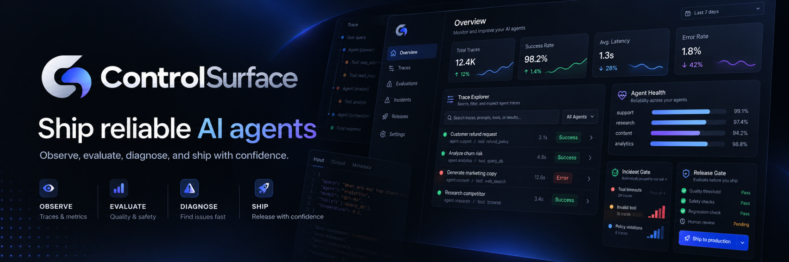
</p>

<p align="center">
  <a href="https://github.com/DevChiniwala/ControlSurface/releases/download/v0.1.0-rc.1/controlsurface-v0.1.0-rc.1-demo.mp4">
    
  </a>
</p>

<p align="center">
  <a href="https://github.com/DevChiniwala/ControlSurface/releases/download/v0.1.0-rc.1/controlsurface-v0.1.0-rc.1-demo.mp4"><strong>Watch the complete 70-second failure-to-release workflow</strong></a>
</p>

## Production failures should make your system smarter.

**Traces tell you what happened. ControlSurface helps you decide what to do next.**

AI agents fail across model calls, tool contracts, retrieval, retries, branching, and state transitions. A raw trace is essential evidence, but it does not tell you whether production is degrading, whether the failure is recurring, which recorded change is associated with it, or whether a candidate actually fixes it.

ControlSurface closes that loop. It connects production telemetry to SLO-backed health, structural failure clusters, incidents with inspectable change evidence, reviewed regression cases, and reproducible release decisions.

<p align="center">
  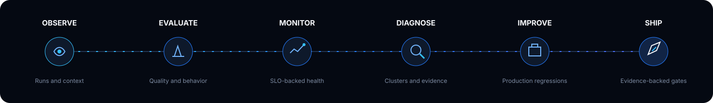
</p>

<p align="center">
  <a href="#why-controlsurface">Why ControlSurface</a> ·
  <a href="#one-control-surface-for-production-ai">Product</a> ·
  <a href="#quickstart">Quickstart</a> ·
  <a href="#run-the-failure-to-release-demo">Demo</a> ·
  <a href="#architecture">Architecture</a> ·
  <a href="#security-and-telemetry-privacy">Security</a> ·
  <a href="#project-status">Status</a>
</p>

## Why ControlSurface

Production telemetry should not stop at dashboards.

When an agent fails, ControlSurface derives a framework-independent execution graph while retaining the original OpenTelemetry spans. It groups recurring behavior using deterministic structural features, connects the affected window to explicitly recorded changes, and keeps representative executions attached to the incident. An engineer can then review a proposed regression case and evaluate future candidates against the same production-derived behavior.

<p align="center">
  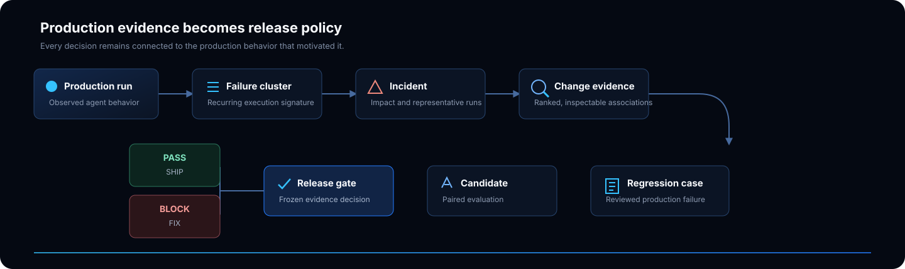
</p>

Four technical ideas anchor the system:

- **AgentRunGraph** derives agent, model, tool, retrieval, retry, branch, and outcome structure without replacing the source spans.
- **Change Ledger** records versioned deployments, agents, prompts, models, tools, schemas, retrievers, and environments for incident analysis.
- **Production-derived regressions** turn representative failures—not every duplicate trace—into editable, human-reviewed cases.
- **Release evidence** pins the compared versions, revisions, evaluator inputs, policy, individual results, and final decision under a SHA-256 content hash.

Evidence rankings represent associations. They are not proof of causation.

## One control surface for production AI

The images below are captures from the real synthetic refund-agent lifecycle. They are not design mockups or fabricated backend responses.

### Production Health

See SLO-backed agent health, observed and failed runs, active incidents, completion rate, latency, and recent executions without beginning from an individual trace.

<p align="center">
  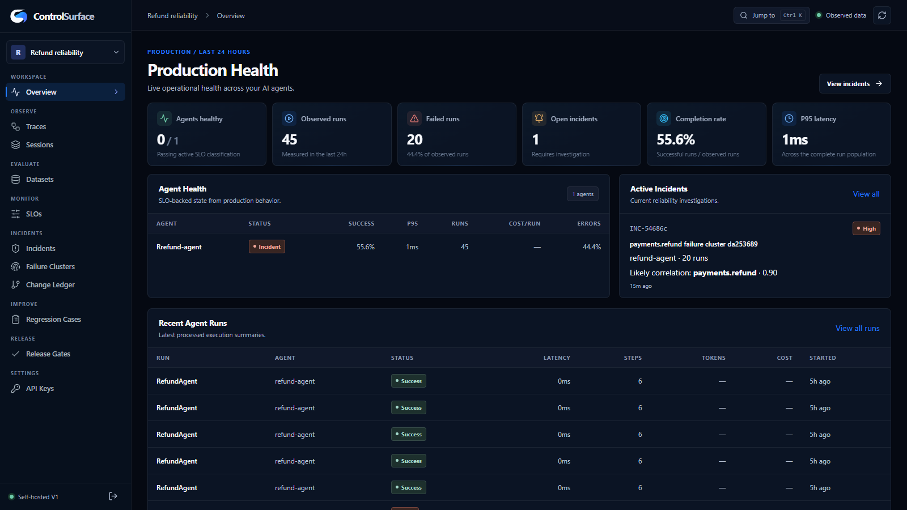
</p>

### Agent-aware tracing

Inspect the execution graph and readable event flow alongside the run list. Models, tools, retrieval, failures, and context remain connected to the raw trace.

<p align="center">
  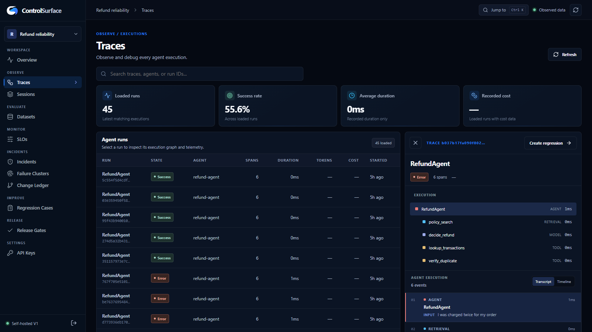
</p>

### Failure intelligence

Group recurring production failures by execution signature and open a representative run instead of triaging identical failures one by one.

<p align="center">
  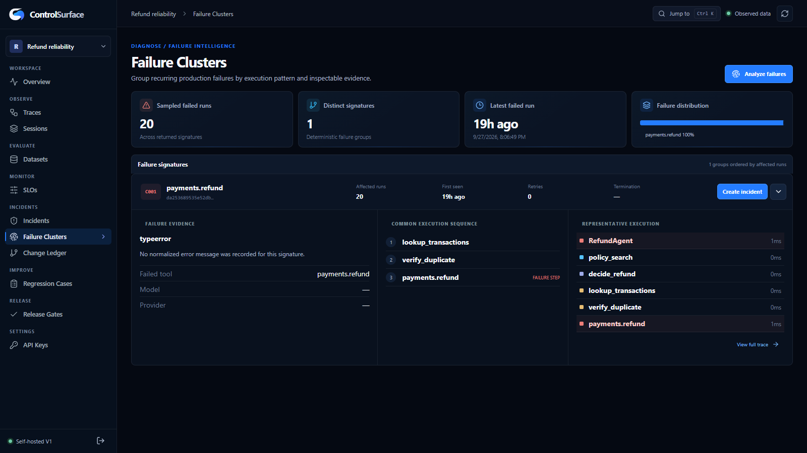
</p>

<table>
  <tr>
    <td width="50%" valign="top">
      <strong>Incident evidence</strong><br><br>
      Rank recorded changes near the failure window and inspect the supporting run evidence. The UI states the limits of the correlation explicitly.
      <br><br>
      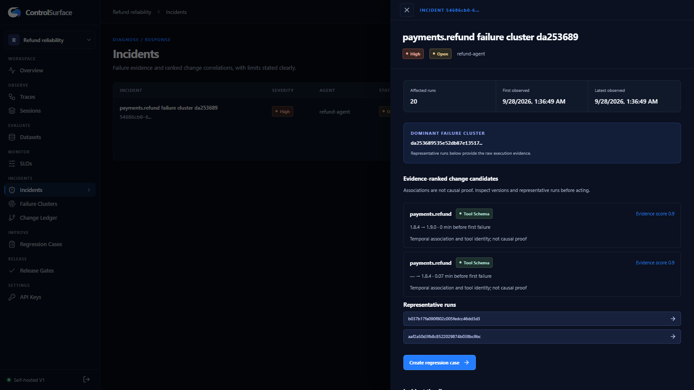
    </td>
    <td width="50%" valign="top">
      <strong>Release gates</strong><br><br>
      Compare a candidate with its baseline and retain the exact policy, revisions, case results, reasons, and evidence hash behind PASS or BLOCK.
      <br><br>
      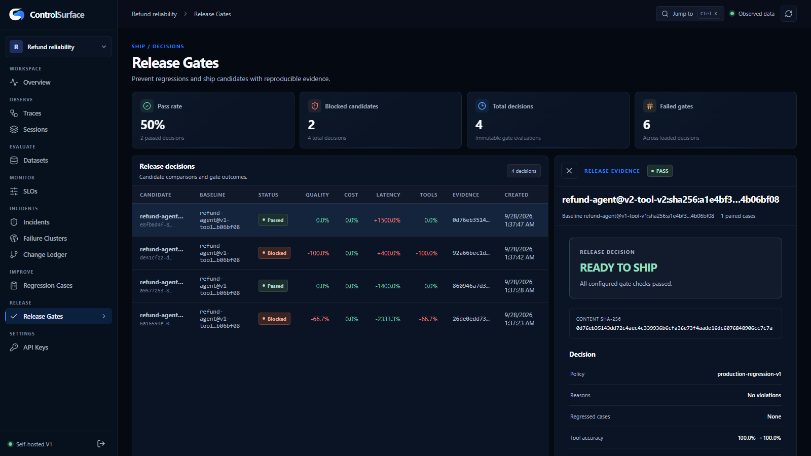
    </td>
  </tr>
</table>

## What ControlSurface does

| Area | Working capability |
| --- | --- |
| **Observe** | Authenticated OTLP/HTTP and OTLP/gRPC, traces, sessions, source spans, AgentRunGraph projections, tokens and supplied cost |
| **Evaluate** | Revisioned datasets, exact/schema/step/tool assertions, trusted local Python evaluators, paired baseline/candidate results |
| **Monitor** | Production Health, completion/tool-success/latency SLOs, minimum sample rules, and explicit no-data behavior |
| **Diagnose** | Deterministic signatures, failure clusters, incidents, tool-schema classification, Change Ledger, ranked nearby changes |
| **Improve** | Editable review-required regression cases linked to source traces and revisioned suite export |
| **Ship** | Deterministic CLI gates, critical-case policy, machine exit status, content-hashed evidence bundles |
| **Operate** | First-boot-safe migrations, bounded inbox, retention TTLs, owner recovery, backup/restore, dead-letter recovery |

## Observe agent execution

ControlSurface accepts OTLP/HTTP and OTLP/gRPC. The Python SDK uses a bounded batch processor and does not mutate the application-wide OpenTelemetry provider. Source trace/span identifiers and attributes remain inspectable; graph normalization is a separate derived projection.

<p align="center">
  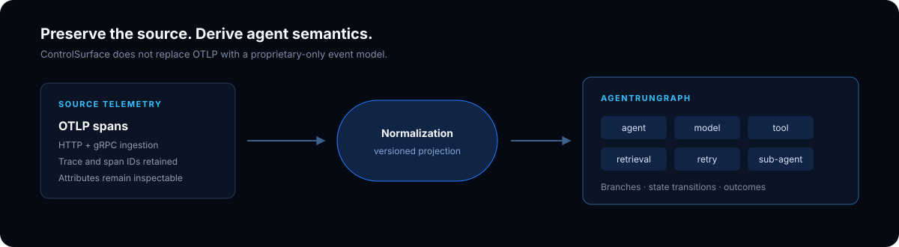
</p>

Install the SDK from the checkout until a package artifact is published:

```bash
python -m pip install -e sdk/python
```

The example below matches the current SDK API:

```python
import os

from controlsurface import ControlSurface

cs = ControlSurface.init(
    endpoint="http://localhost:4318",
    api_key=os.environ["CONTROLSURFACE_API_KEY"],
    service_name="support-service",
    agent_name="refund-agent",
    agent_version="v19",
    environment="production",
)

try:
    with cs.session():
        with cs.run("support-request", input="I was charged twice"):
            with cs.span("policy-search", kind="retrieval"):
                pass
            with cs.span("lookup-transactions", kind="tool"):
                pass
finally:
    cs.shutdown()
```

Export happens off the application path. If the endpoint is unavailable, agent work continues; queued telemetry can still be lost during process termination or an extended outage.

## Diagnose recurring failures

Failure signatures are built from deterministic facts such as the failed tool, exception or error type, tool sequence, repeated calls, retry behavior, execution outcome, and termination reason. Clusters expose representative runs and their structural features rather than hiding the grouping behind an opaque model response.

<p align="center">
  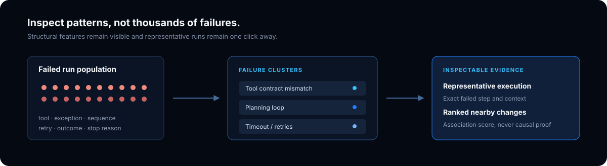
</p>

### Connect failures to what changed

The Change Ledger records production changes as first-class data: deployments, agent versions, model configuration, prompt versions, tool versions, tool schemas, retrievers, and environment metadata. Incident analysis ranks changes near the failure window and shows its supporting facts. It does not claim causal proof.

## Turn production failures into regression tests

An incident can produce an editable regression candidate from a representative execution. The engineer reviews the input, expected completion, required and forbidden tools, and step limits before accepting it into a revisioned suite.

<p align="center">
  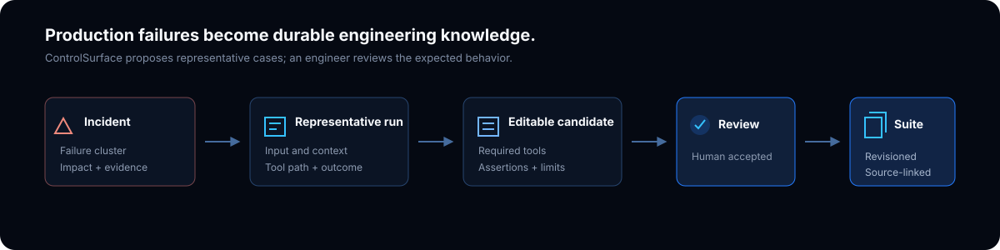
</p>

This keeps the suite compact: a cluster with many similar failures can yield a small set of representative cases instead of one test per trace.

## Gate releases with production evidence

The release gate compares paired baseline and candidate results under an explicit policy. Current deterministic gates cover quality, tool correctness, latency, cost, critical regressions, and minimum case count.

<p align="center">
  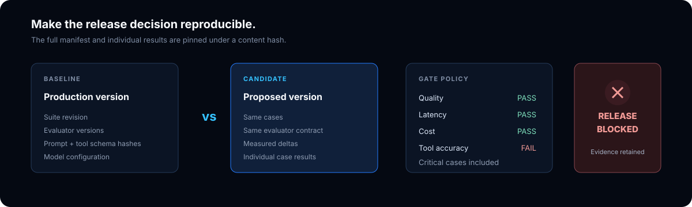
</p>

Release evidence pins the baseline and candidate manifests, dataset and regression-suite revisions, evaluator versions, model configuration, prompt and tool-schema hashes, policy, and individual case results. The bundle is content-hashed for reproducibility; it is not externally signed or described as tamper-proof.

### Put ControlSurface in CI

<p align="center">
  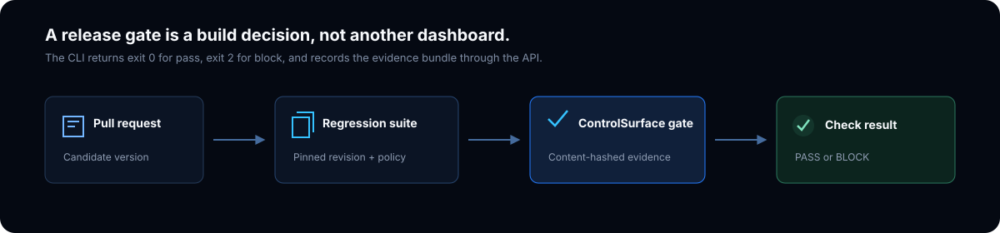
</p>

The working CLI command is:

```bash
controlsurface gate \
  --baseline baseline.json \
  --candidate candidate.json \
  --manifest manifest.json \
  --policy gate_policy.json \
  --out release-evidence.json
```

The command exits `0` for PASS, `2` for BLOCK, and `1` for operational or validation errors. It prints the decision, SHA-256 evidence identifier, and gate reasons.

## Quickstart

Requirements: Docker with Compose and Python 3.11+ for the SDK/CLI. The local stack binds to loopback ports `3000`, `8000`, `4317`, `4318`, `55432`, and `58123`.

```bash
git clone https://github.com/DevChiniwala/ControlSurface.git
cd ControlSurface
cp .env.example .env
```

On PowerShell, use `Copy-Item .env.example .env`. Replace the three placeholder values in `.env` with independent random secrets, then start the stack:

```bash
docker compose up --build -d --wait
docker compose ps -a
```

The one-shot `migrate` service should exit with code `0`. Open [http://localhost:3000](http://localhost:3000), create the owner and first project with the bootstrap token from `.env`, and create a project API key. The plaintext project key is displayed once.

| Service | Local endpoint |
| --- | --- |
| Web application | `http://localhost:3000` |
| Control API | `http://localhost:8000` |
| OTLP/HTTP traces | `http://localhost:4318/v1/traces` |
| OTLP/gRPC | `localhost:4317` |

After installing the SDK, export `CONTROLSURFACE_API_KEY` and `CONTROLSURFACE_PROJECT_ID`. Validate the API, databases, and project key with:

```bash
controlsurface doctor
```

<details>
<summary><strong>Local setup notes</strong></summary>

- `CS_TRACE_RETENTION_DAYS` optionally configures ClickHouse TTLs from 1 to 3650 days.
- Non-default browser/API origins require both `CS_PUBLIC_API_URL` and `CS_CORS_ORIGINS`, followed by a web rebuild.
- Compose is the supported local V1 deployment path. It is not presented as a hardened production Kubernetes profile.
- See [Operations](docs/OPERATIONS.md) for readiness, backup/restore, retention, outage recovery, and migration policy.

</details>

## Run the failure-to-release demo

The [refund-agent example](examples/refund_agent/README.md) uses synthetic payment data and a deterministic decision-model fixture by default. It exercises the real SDK, ingest path, worker, ClickHouse projections, SLOs, tool-schema change, clustering, incident analysis, regression API, candidate evaluation, and release gate without a paid model API.

```bash
python -m pip install -e sdk/python
python examples/refund_agent/demo.py
```

The lifecycle is deliberately concrete:

```text
healthy traffic → breaking tool schema → degraded health → failure cluster
→ incident evidence → reviewed regression → fixed candidate → release gate PASS
```

The exact baseline, broken-candidate, fixed-candidate, manifest, and gate commands are in the [example guide](examples/refund_agent/README.md). The intentionally broken evaluation and gate exit `2`; the fixed candidate exits `0`.

## Architecture

<p align="center">
  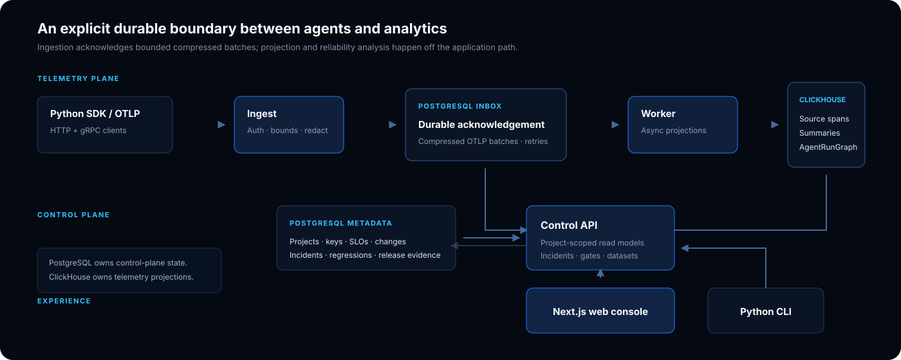
</p>

- **PostgreSQL** stores identity, project and reliability metadata, immutable workflow records, and the bounded compressed telemetry inbox.
- **ClickHouse** stores source span facts, summaries, and versioned AgentRunGraph projections.
- **Python** powers the fail-safe SDK, CLI, ingest/control services, worker, evaluation, and reliability logic.
- **Next.js** provides the project-scoped operational console.

Projection failures never make an instrumented agent request wait. The worker retries and eventually quarantines repeatedly failing batches for explicit recovery. Read [ARCHITECTURE.md](ARCHITECTURE.md) for boundaries, idempotency, graph semantics, and backpressure behavior.

## Security and telemetry privacy

Telemetry can contain prompts, customer content, credentials in tool arguments, and other sensitive data. ControlSurface currently provides Argon2 password hashing, hashed high-entropy project API keys, project isolation, session-bound CSRF protection, request and decompression bounds, parameterized SQL, strict CORS, security headers, loopback Compose bindings, and a redaction foundation.

The V1 trust model is a trusted single owner on a trusted self-hosted machine. It does not provide enterprise SSO/RBAC, hostile evaluator sandboxing, built-in TLS termination, distributed rate limiting, or protection from a privileged host/database operator. Free-text secret detection is intentionally limited. Users remain responsible for appropriate redaction, retention, access, and deployment policies.

Read [SECURITY.md](SECURITY.md) before sending production telemetry.

## Performance

ControlSurface publishes reproducible harnesses, not production-capacity claims. A measured local run on **2026-09-27** used Python 3.13.15, Linux 6.6 under WSL2, single-node Docker Compose, loopback traffic, 10,000 throughput spans, and dedicated 1K/10K-span traces.

| Measurement | p50 | p95 |
| --- | ---: | ---: |
| OTLP/HTTP acknowledgement | 48.730 ms | 105.534 ms |
| Trace-list API, 50 rows | 25.173 ms | 32.520 ms |
| 1,000-span trace detail | 145.438 ms | 156.202 ms |
| 10,000-span trace detail | 1,122.591 ms | 1,257.100 ms |
| Deterministic clustering, 2,000 failed runs | 5.646 ms | 5.769 ms |

The same run measured 1,245.94 spans/second. These synthetic single-machine results do not establish sustained-load capacity, high availability, WAN performance, or production sizing. Full conditions, browser measurements, storage estimates, caveats, and reproduction commands are in [benchmarks/README.md](benchmarks/README.md).

## Project status

ControlSurface is an early open-source release candidate.

**Working today:**

- OTLP/HTTP and OTLP/gRPC ingestion
- Python SDK and CLI
- traces, sessions, source spans, and AgentRunGraph
- datasets and deterministic evaluation
- Production Health and SLO classification
- failure clustering, incidents, and change evidence
- reviewed production-derived regression cases
- baseline/candidate release gates and immutable evidence records
- first-boot migrations, retention, backup/restore, and outage recovery guidance

**Planned next:**

- always-on SLO windows, error budgets, and incident proposals
- deeper tool and MCP contract intelligence
- pull-request release reporting
- TypeScript SDK and selected framework integrations
- stronger evaluator isolation and asynchronous evaluation jobs
- production deployment and larger-tenancy profiles

See [ROADMAP.md](ROADMAP.md) for sequencing and explicit non-goals.

## Contributing

Contributions are welcome—especially focused bug reports, documentation, integrations, performance work, reliability logic, and UI/UX improvements. Read [CONTRIBUTING.md](CONTRIBUTING.md) before opening a change.

Please never commit customer telemetry, `.env` files, project keys, generated evidence, or fabricated benchmark results.

## License

ControlSurface is created and maintained by **Dev Chiniwala** and licensed under the [Apache License 2.0](LICENSE). Dependencies retain their own licenses; see [THIRD_PARTY_NOTICES.md](THIRD_PARTY_NOTICES.md).

<p align="center">
  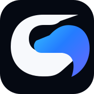
</p>

<p align="center">
  <strong>Production engineering for AI agents.</strong><br><br>
  <a href="LICENSE">Apache-2.0</a> ·
  <a href="ARCHITECTURE.md">Architecture</a> ·
  <a href="CONTRIBUTING.md">Contributing</a> ·
  <a href="SECURITY.md">Security</a>
</p>
