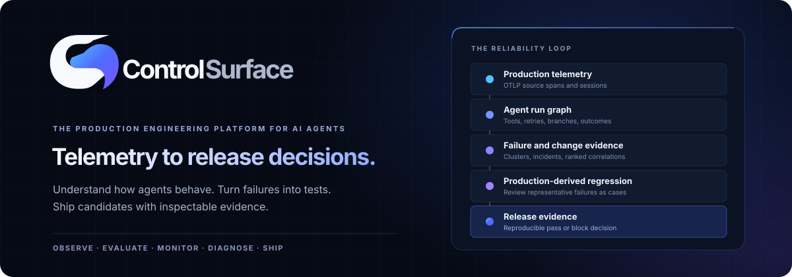

# ControlSurface

<p align="center">
  
</p>

**The production engineering platform for AI agents.**

Observe · Evaluate · Monitor · Diagnose · Ship

ControlSurface connects what happened in production to what should happen at the next release. It retains OpenTelemetry source spans, derives a framework-independent agent run graph, groups failures, relates them to recorded changes, and turns reviewed production failures into regression tests and content-hashed release evidence.

> **Pre-release, self-hosted V1.** The deterministic end-to-end workflow and one browser journey have passed locally. This is not a hardened hosted service or a substitute for human release review. The Python package and container images are not published. See [current limitations](#project-status-and-limits).

## The engineering loop

| Stage        | What ControlSurface does today                                                                                                                                                                           |
| ------------ | -------------------------------------------------------------------------------------------------------------------------------------------------------------------------------------------------------- |
| **Observe**  | Accepts authenticated OTLP/HTTP and OTLP/gRPC traces; links sessions, agent runs, model, tool, retrieval, memory, retry, and sub-agent spans; shows latency, errors, and supplied token/cost attributes. |
| **Evaluate** | Stores datasets and items; runs deterministic assertions and optional trusted Python evaluators locally; compares paired baseline and candidate results.                                                 |
| **Monitor**  | Computes observed agent health over a 24-hour window and applies completion, tool-success, and latency SLO policies.                                                                                     |
| **Diagnose** | Builds an `AgentRunGraph`, groups recent failures by deterministic signatures, and ranks nearby recorded changes with inspectable evidence. Scores indicate association, **not proof of cause**.         |
| **Ship**     | Mines representative regression candidates for review, exports revisioned suites, and produces a content-hashed, API append-only pass/block evidence bundle from a local or CI gate.                     |

The source trace stays intact. The run graph, failure signatures, and reliability signals are separate projections, so an engineer can inspect the raw evidence behind a decision.

## Run it locally

You need Docker with Compose, Python 3.11+, and free local ports **3000**, **8000**, **4317**, **4318**, **55432**, and **58123**. The Compose services bind host ports to loopback.

```bash
git clone https://github.com/DevChiniwala/ControlSurface.git
cd ControlSurface
cp .env.example .env
```

On PowerShell, use `Copy-Item .env.example .env` instead of `cp`. Before starting, edit `.env` and replace **all three** placeholder values (`CS_DB_PASSWORD`, `CS_CH_PASSWORD`, and `CS_BOOTSTRAP_TOKEN`) with different, long random secrets. Never commit `.env`.

```bash
docker compose up --build -d
docker compose ps
```

Wait for `migrate` to exit successfully, then open **http://localhost:3000**. Create the first owner and project with the bootstrap token from your private `.env`. In **API keys**, create a project key and copy it when shown; the plaintext key is not shown again.

The API is at `http://localhost:8000`. OTLP/HTTP traces go to `http://localhost:4318/v1/traces`; OTLP/gRPC is at `localhost:4317`.

> On a fresh Docker volume, ClickHouse initialization can briefly race the first migration attempt. If `migrate` fails to connect to ClickHouse, wait for its container to become healthy and rerun `docker compose up -d`. This startup race is tracked as a release-readiness issue, not considered normal production behavior.

### Instrument a Python agent

Install the SDK and CLI from this checkout; `pip install controlsurface` is **not** a published-install path yet.

```bash
python -m pip install -e sdk/python
```

Set `CONTROLSURFACE_API_KEY` to the project key you just created. For example, in PowerShell:

```powershell
$env:CONTROLSURFACE_API_KEY = "<your-project-key>"
controlsurface doctor
```

For Bash, use `export CONTROLSURFACE_API_KEY='<your-project-key>'`. `doctor` checks API/database readiness and key access; it does not send telemetry.

This minimal example emits a session and typed agent, retrieval, and tool spans:

```python
from controlsurface import ControlSurface

cs = ControlSurface.init(
    endpoint="http://localhost:4318",
    agent_name="support-agent",
    environment="development",
)
try:
    with cs.session():
        with cs.run("support-request"):
            with cs.span("policy-search", kind="retrieval"):
                policies = ["Verify the transaction before issuing a refund"]
            with cs.span("transaction-check", kind="tool"):
                verified = bool(policies)
finally:
    cs.shutdown()
```

Replace the example operations with your own agent work. Instrumentation is explicit in V1; there is no claim of automatic support for every agent framework. The exporter batches asynchronously and is designed not to fail application work when ControlSurface is unavailable, but queued telemetry can be lost. Prompt and tool content are **not captured automatically**; explicitly supplied input or attributes may be sensitive. Read [SECURITY.md](SECURITY.md) before sending real data.

### See the failure-to-release workflow

The included [refund-agent example](examples/refund_agent/README.md) uses synthetic customer/payment data and a deterministic model fixture by default—no paid model account is needed. It emits healthy runs, registers a breaking payment-tool schema, emits failures, discovers a cluster, creates an incident with change evidence, and emits a fixed candidate. The example explains how to review/export cases and run blocked and passing release gates.

To run it, set `CONTROLSURFACE_PROJECT_ID` to the ID of your new project. Retrieve the ID with your key:

```bash
curl -H "Authorization: Bearer $CONTROLSURFACE_API_KEY" http://localhost:8000/api/projects
```

In PowerShell, use `Invoke-RestMethod http://localhost:8000/api/projects -Headers @{ Authorization = "Bearer $env:CONTROLSURFACE_API_KEY" }`. Set the ID from the response with `$env:CONTROLSURFACE_PROJECT_ID = "<project-id>"`; in Bash, use `export CONTROLSURFACE_PROJECT_ID='<project-id>'`. Then run:

```bash
python examples/refund_agent/demo.py
```

Open **Production Health → Incidents → representative trace → regression case** in the app. The example is intentionally controlled; its fixture calls and recorded costs are not claims about a real model provider or production traffic. Its optional live-model mode is separately documented and may incur charges.

## How it is built

```text
Python SDK or any authenticated OTLP client
  → OTLP receiver → bounded, compressed PostgreSQL inbox
  → asynchronous worker → ClickHouse source traces + AgentRunGraph projections
                                  ↓
PostgreSQL projects, SLOs, changes, incidents, regressions, release evidence
                                  ↓
                       project-scoped API → web application / CLI
```

PostgreSQL holds operational metadata and the durable telemetry inbox; ClickHouse holds source spans, trace summaries, and graph projections. A failed ClickHouse projection is retried rather than making the instrumented application wait for analytics. See [ARCHITECTURE.md](ARCHITECTURE.md) for storage boundaries, backpressure, idempotency, and graph semantics.

| Directory                                        | Purpose                                                    |
| ------------------------------------------------ | ---------------------------------------------------------- |
| [`apps/web`](apps/web)                           | Next.js application and browser tests                      |
| [`services/controlplane`](services/controlplane) | API, OTLP ingest, worker, domain logic, migrations         |
| [`sdk/python`](sdk/python)                       | Python telemetry SDK, evaluator, and CLI                   |
| [`examples/refund_agent`](examples/refund_agent) | Synthetic failure-to-fix walkthrough                       |
| [`tests/e2e`](tests/e2e)                         | Disposable full-stack acceptance path                      |
| [`benchmarks`](benchmarks)                       | Local measurement harnesses, not published capacity claims |

## Project status and limits

ControlSurface is under active development. The local V1 closed-loop test passes, but several capabilities remain intentionally incomplete: server-side asynchronous evaluation jobs, general LLM judges, broad automatic framework instrumentation, a TypeScript SDK, persistent error-budget accounting, advanced drift and alerts, multi-user SSO/RBAC, managed retention, and production HA. The authenticated application’s visual redesign is also still in progress beyond the sign-in screen and shared theme.

The current release gate is reproducible at the API level, not tamper-proof against a database administrator. Root-cause rankings are evidence scores, not causal probabilities. A broader security, performance, accessibility, operator-recovery, and binary dependency-license review is required before a public production release. Read the [engineering report](FINAL_ENGINEERING_REPORT.md) for verified tests and open gates, [roadmap](ROADMAP.md) for next work, and [third-party notices](THIRD_PARTY_NOTICES.md) for dependency-license considerations.

## Contribute and report issues

Start with [CONTRIBUTING.md](CONTRIBUTING.md) for local checks and test-stack safety. Please report vulnerabilities privately as described in [SECURITY.md](SECURITY.md); do not attach sensitive prompts or traces to a public issue. The project follows the [code of conduct](CODE_OF_CONDUCT.md).

ControlSurface is created and maintained by **Dev Chiniwala**. Original ControlSurface source is licensed under [Apache-2.0](LICENSE); dependencies retain their own licenses.
